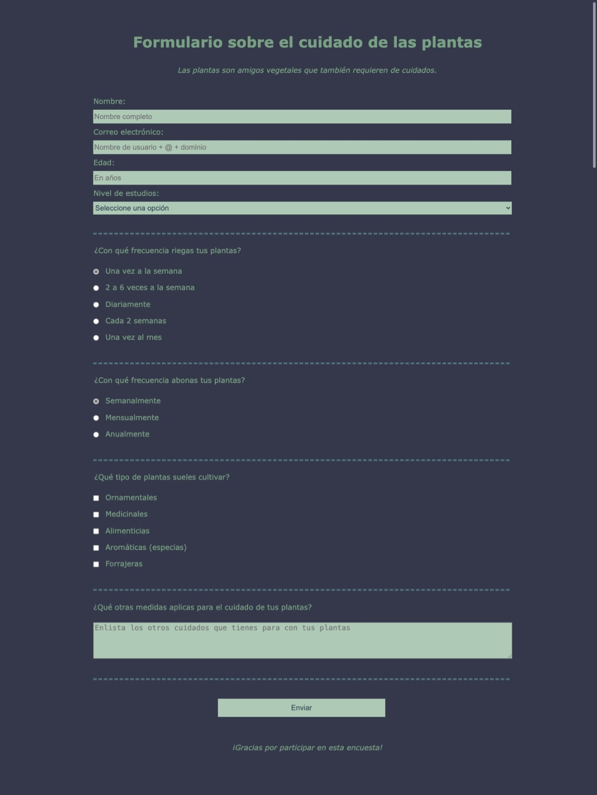

# Formulario: Cuidado de las plantas

## Descripción del proyecto
Formulario de prueba elaborado con la finalidad de aplicar conocimientos básicos de html y css.

## Estado del proyecto
Finalizado

## Teconologías utilizadas
- **Lenguajes de programación:** HTML y CSS
- **Entorno de desarrollo:** Visual Studio Code

## Captura de la página web
